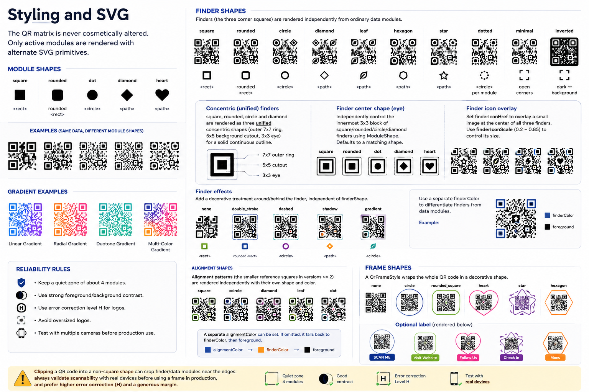

# Neox QR Code

Reusable Symfony UX QR Code package: Twig Components + Stimulus + custom SVG renderer + API + secure payloads.



## Included

- QR matrix generated by `bacon/bacon-qr-code`
- custom SVG renderer owned by this package
- module shapes: `square`, `rounded`, `dot`, `diamond`, `heart`
- finder shapes: `square`, `rounded`, `circle`
- colors, finder color, linear/radial gradients
- central logo (local URL or data URI) with optional background
- built-in presets: `classic`, `dots`, `rounded`, `heart`, `gold`, `gradient`
- QR style validation: contrast, quiet zone, logo/correction warnings
- `<twig:NeoxQrCode>` display component
- `<twig:NeoxQrCodeEditor>` live Stimulus editor
- API: SVG, PNG, matrix, validation, presets
- signed, expiring, single-use and optionally encrypted payload service
- PNG export through Imagick when available
- `/docs` with installation, architecture, API, editor, security and extension guide

## Install

```bash
composer require xorgxx/neox-qrcode-bundle
```

If Flex does not register the bundle automatically:

```php
// config/bundles.php
Xorgxx\NeoxQrCodeBundle\NeoxQrCodeBundle::class => ['all' => true],
```

Import API routes when wanted:

```yaml
# config/routes/neox_qrcode.yaml
neox_qrcode:
    resource: '@NeoxQrCodeBundle/config/routes.yaml'
```

For secure payloads define a secret of at least 32 characters outside source control:

```dotenv
NEOX_QRCODE_SECRET=change-me-with-a-long-random-secret
```

## Basic component

```twig
<twig:NeoxQrCode
    content="https://example.com"
    size="360"
    moduleShape="dot"
    finderShape="rounded"
    foreground="#111111"
    finderColor="#D59618"
    errorCorrection="H"
/>
```

## Gradient + logo

```twig
<twig:NeoxQrCode
    content="https://example.com"
    moduleShape="rounded"
    gradientType="linear"
    foreground="#111111"
    gradientTo="#D59618"
    logoHref="/images/logo.svg"
    errorCorrection="H"
/>
```

## Preset

```twig
<twig:NeoxQrCode content="https://example.com" preset="heart" />
```

## Live editor

```twig
<twig:NeoxQrCodeEditor content="https://example.com" />
```

See [`docs/index.md`](docs/index.md) — documentation available in [English](docs/en/index.md) and [French](docs/fr/index.md).


## IA / agents de code

Avant toute modification automatisée, lire [`AGENTS.md`](AGENTS.md). Il définit la philosophie, les règles, workflows, contraintes de sécurité et la définition de terminé.
